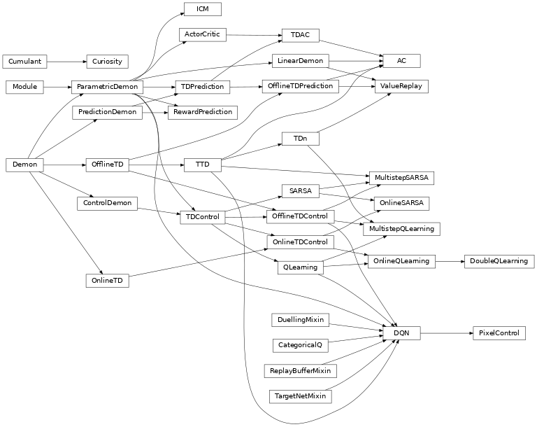

## What is pandemonium?

**pandemonium** is a library that provides implementations for Reinforcement Learning agents that seek to learn about their environment by predicting _multiple_ signals from a
 _single_ stream of experience.

The project is inspired by the [architecture](http://incompleteideas.net/papers/pandemonium.pdf) originally developed by Oliver Selfridge in 1959. 
His computational model is composed of different groups of “demons” working independently to process the visual stimulus, hence the name – **pandemonium**.

The original pandemonium framework, in turn, served as an inspiration to some of the more recent work such as [Horde](http://incompleteideas.net/papers/horde-aamas-11.pdf) by Sutton et. al 2011. 
The authors designed a scalable real-time architecture for learning knowledge from unsupervised sensorimotor interaction. 
Since then, Horde was further developed and formalized in Adam White’s Doctoral [thesis](https://sites.ualberta.ca/~amw8/phd.pdf), from which this library borrows most of the definitions and notation.

The goal of this project is to further develop the computational framework established by the creators of Horde and express some of the latest algorithms in RL in terms of hierarchy of demons. 

The goal of this project is to further develop the computational framework established by the creators of Horde and express some of the common algorithms in RL in terms of hierarchy of demons. 

### A research toolbox

A single demon can be seen as a sub-agent responsible for learning a piece of predictive knowledge about the agent’s interaction with its environment. 
Often times this sub-agent utilizes a reinforcement learning mechanism in itself by learning a [General Value Function](pandemonium/gvf.py), albeit a self-supervised variant is also common. 
For example, if the agent implements Actor Critic architecture, an [Intrinsic Curiosity Module](pandemonium/implementations/icm.py#L15) can be interpreted as a demon that learns to predict the features generated by the agent's encoder, thereby guiding the actor in the direction of novel states. 
In the same fashion a [Pixel Control](pandemonium/implementations/unreal.py#L114) demon learns to affect the visual observations in a way that improves the representation learning of the UNREAL actor. 
Some demons can be completely independent from each other, allowing for parallel learning; others share replay buffers, feature extractors or even intermediate computations, enabling complex interactions.
Having multiple demons does not make **pandemonium** a "distributed RL" library in the sense that the agent does not interact with hundreds of environments in parallel.
Instead, the focus is on a __single__ stream of experience, but __multiple__ signals / targets / goals to predict / control / achieve.

### A piece of software

From a purely programming perspective, the library is designed in a way such that the common building blocks of RL agents are abstracted into modular components which are easy to swap and configure. 
The structural elements (such as control vs prediction or online vs multistep) are meant to be inherited, while the algorithm specific functionality (i.e an update rule, a duelling network or intrinsic reward source) can be mixed in. 
Below is a birds-eye view of the building blocks that constitute **pandemonium**: 

The auto-differentiation backend is provided by PyTorch, although a JAX version is being considered. 

All the experiment management and monitoring is done via [Ray Tune](https://docs.ray.io/en/latest/tune.html) and [Ray Dashboard](https://docs.ray.io/en/latest/ray-dashboard.html) respectively. 
See [experiments](experiments) module for concrete examples of how to configure and run algorithms.

## More info

Extended [documentation](http://konichuvak.github.io/pandemonium/)

### Integrated algorithms
- [ ] [Actor Critic family](pandemonium/implementations/a2c.py)
  - [x] Policy gradient with value baseline
  - [ ] Multiprocessing
  - [x] Intrinsic Curiosity Module
  - [ ] Recurrence
- [ ] [DQN family](pandemonium/implementations/rainbow.py)
  - [x] Q-learning
  - [x] Target network
  - [x] Double Q-learning
  - [x] Duelling network
  - [x] Prioritized Experience Replay   
  - [ ] Noisy Networks
- [ ] Distributional Value Learning
  - [x] C51
  - [ ] QR-DQN
  - [ ] IQN
- [x] [UNREAL](pandemonium/implementations/unreal.py)
  - [x] Value Replay
  - [x] Reward Prediction
  - [x] Pixel Control
- [ ] [Option Critic](pandemonium/implementations/option_critic.py)

### Integrated environemnts
- [x] [MiniGrid](pandemonium/envs/minigrid)
- [x] [DeepmindLab](pandemonium/envs/dm_lab)
- [ ] [Atari](https://github.com/mgbellemare/Arcade-Learning-Environment)
- [ ] [ProcGen](https://github.com/openai/procgen)
- [ ] [DeepmindControlSuite](https://github.com/deepmind/dm_control)
- [ ] [ViZDoom](https://github.com/mwydmuch/ViZDoom)
- [ ] [Nethack](https://github.com/facebookresearch/nle)
- [ ] [Playstation](https://github.com/pcsxr/PCSX-Reloaded/tree/master/pcsxr)
